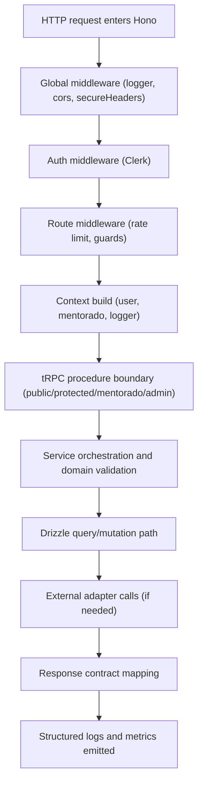
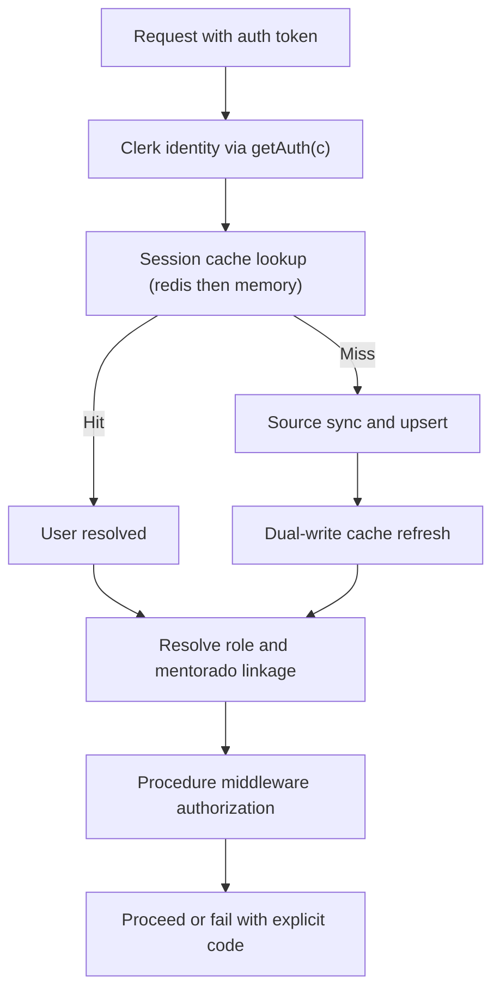
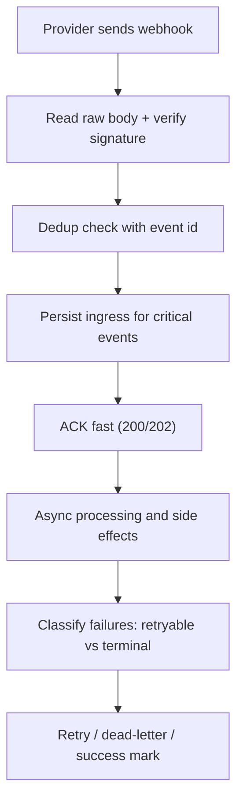
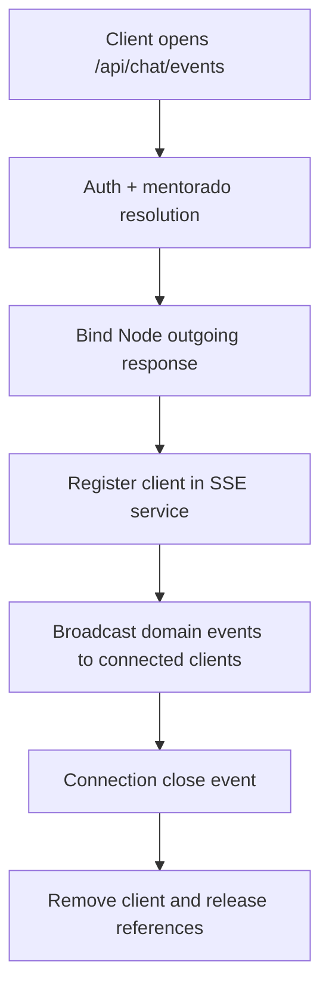
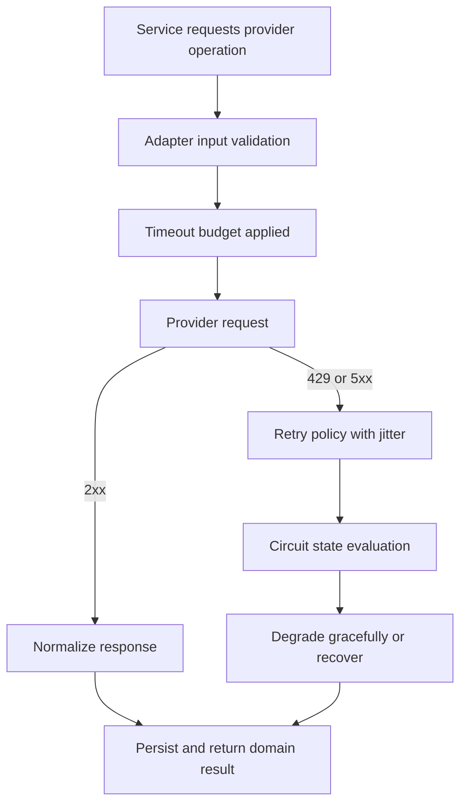

# Request Lifecycle Maps — Hono Runtime

Use these maps as canonical execution flow for backend implementation and incident triage.

## Core API Lifecycle (Hono)

## Auth and Context Lifecycle

## Webhook Lifecycle

## SSE Lifecycle (Broadcast Service Model)

## External API Lifecycle

## Validation Points by Stage

| Stage | Must Validate |
|---|---|
| Edge | request size, rate limit, route trust |
| Auth | token validity, identity stability |
| Context | role linkage, mentorado linkage, correlation logger |
| Service | domain invariants, idempotency presence |
| DB | index-aware query, conflict-safe writes |
| External | timeout, retry class, rate-limit behavior |
| Response | stable error contract + correlation id |

## Hono API Quick Reference

| Operation | Hono API |
|---|---|
| Parse JSON body | `await c.req.json()` |
| Parse text body | `await c.req.text()` |
| Read query param | `c.req.query("foo")` |
| Read path param | `c.req.param("id")` |
| Read header | `c.req.header("x")` |
| JSON response | `c.json(data, 200)` |
| Redirect | `c.redirect(url)` |
| Middleware signature | `async (c, next) => { ... await next(); }` |
| Error handler | `app.onError((err, c) => ...)` |
