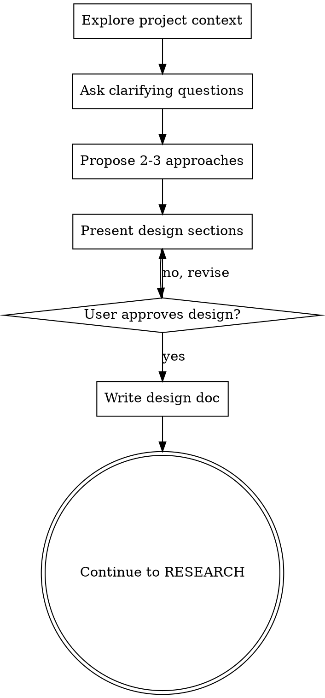

# Discover — Brainstorming & Discovery Protocol

**Quando usar:** Requirements ambiguous, new features, L6+ tasks, ANY creative work.
**Quando skip:** Bug fixes, well-scoped tasks, established patterns.

---

## HARD GATE

<EXTREMELY-IMPORTANT>
Do NOT invoke any implementation skill, write any code, scaffold any project, or take any implementation action until you have presented a design and the user has approved it.

This applies to EVERY project regardless of perceived simplicity. "Simple" projects are where unexamined assumptions cause the most wasted work.
</EXTREMELY-IMPORTANT>

---

## Checklist (In Order)

- [ ] **1. Explore project context** — check files, docs, recent commits
- [ ] **2. Ask clarifying questions** — one at a time, understand purpose/constraints/success
- [ ] **3. Propose 2-3 approaches** — with trade-offs and your recommendation
- [ ] **4. Present design** — in sections scaled to complexity, get approval after each
- [ ] **5. Write design doc** — save to `docs/plans/YYYY-MM-DD-<topic>-design.md`
- [ ] **6. Transition to planning** — continue to RESEARCH phase

---

## Process Flow



---

## Step 1: Entender Contexto

1. Check relevant files/docs
2. Identify existing patterns
3. Note tech stack constraints
4. Review recent commits for context

---

## Step 2: Clarificar Ideias

**UMA pergunta por vez — nunca sobrecarregar:**

| Pergunta | Tipo |
|----------|------|
| "Qual o problema que resolve?" | Purpose |
| "MVP / Padrão / Completo?" | Scope |
| "Hard requirements?" | Constraints |
| "Como sabemos que está pronto?" | Success |

**Exemplo:**
```
❌ "O que o dashboard mostra? Como fica? Fontes de dados?"

✅ "Qual dado é mais crítico?
A) Revenue (MRR)
B) Fluxo de pacientes
C) Saúde operacional"
```

---

## Step 3: Explorar Abordagens (2-3 opções)

**SEMPRE apresentar múltiplas opções com trade-offs:**

```
## Abordagens

### A) [Recomendada] — Descrição
- Pros: ...
- Cons: ...
- Esforço: ~X horas

### B) Alternativa — Descrição
- Pros: ...
- Cons: ...
- Esforço: ~Y hours

### C) Alternativa — Descrição
- Pros: ...
- Cons: ...

**Recomendação:** A, porque [razão específica].
```

---

## Step 4: Apresentar Design

**Incremental validation — 200-300 palavras por seção:**

1. Present first section
2. Ask: "Does this look right so far?"
3. If no → revise and re-present
4. If yes → continue to next section
5. Repeat until all sections approved

**Cover:**
- Architecture overview
- Components/modules
- Data flow
- Error handling
- Testing approach

---

## Step 5: Write Design Doc

**Save to:** `docs/plans/YYYY-MM-DD-<topic>-design.md`

```markdown
# [Feature Name] Design Document

**Date:** YYYY-MM-DD
**Status:** Approved

## Problem
[What problem does this solve?]

## Solution
[The chosen approach and why]

## Architecture
[2-3 paragraphs with diagrams if needed]

## Components
[List of components to build]

## Data Flow
[How data moves through the system]

## Edge Cases
[Known edge cases to handle]

## Questions Resolved
- Q: [Question] → A: [Decision]

## Questions Pending
- [Any remaining unknowns]
```

**Commit the design document to git.**

---

## Step 6: Transition

After design is approved and documented:

> Design approved and saved to `docs/plans/YYYY-MM-DD-<topic>-design.md`.
>
> **Next:** Continue to RESEARCH phase to gather findings before creating implementation plan.

---

## MCP Cascade (For Research)

```
1. Codebase → Grep/Glob/Read
   └─► Confidence: 5 (verified in code)

2. Tavily → search/searchContext/extract
   └─► Confidence: 4-5 (freshest web data)

3. NotebookLM → ask_question (project memory)
   └─► Confidence: 4-5 (curated validation)

4. Sequential Thinking → synthesis
   └─► For complex decisions
```

### Tavily (Primary)

```
tavily_search → tavily_searchContext → tavily_extract
```

### NotebookLM (Validation)

```
ask_question(notebook_id: "neondash-project-memory", question: "...")
ask_question(notebook_id: "planning-prompt-engineering", question: "...")
```

### Sequential Thinking

| Situação | Pensamentos |
|----------|-------------|
| Bug simples | 2-3 |
| Feature | 4-5 |
| Arquitetura | 6-8 |

---

## Principles

| Princípio | Por quê |
|-----------|---------|
| Uma pergunta | Evita sobrecarga |
| Múltipla escolha | Resposta mais fácil |
| Liderar recomendação | Usuário quer orientação |
| Validação incremental | Captura mal-entendidos |
| YAGNI | Evita scope creep |
| Design doc FIRST | Prevents implementation mistakes |

---

## Anti-Pattern: "This Is Too Simple To Need A Design"

Every project goes through this process. A todo list, a single-function utility, a config change — all of them. The design can be short (a few sentences for truly simple projects), but you MUST present it and get approval.

---

## Anti-Hallucination

- **NUNCA** especular sobre código não lido
- **SEMPRE** ler arquivos antes de afirmar
- **SE** desconhecido → pesquisar ou marcar Knowledge Gap

---

## Red Flags — STOP

| Red Flag | Action |
|----------|--------|
| Coding before design approved | Stop. Complete design first. |
| Skipping approaches | Generate 2-3 alternatives |
| No design document | Write it before continuing |
| Multiple questions at once | Ask one at a time |
| User seems confused | Go back to clarifying questions |
