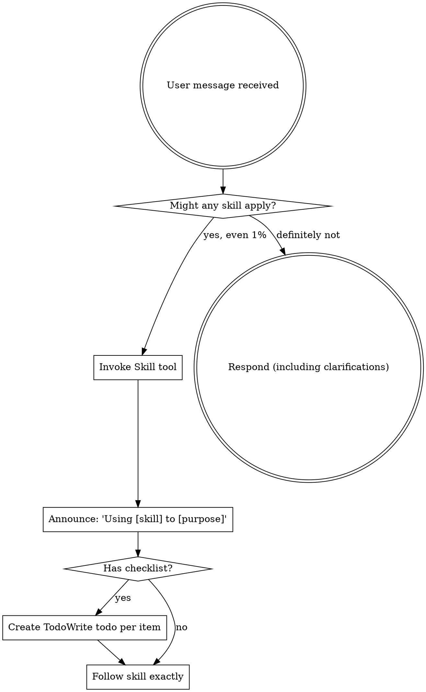

# Portal NEON DASHBOARD — Agent Rules & Project Specification

> **Single source of truth for ALL AI agent behavior AND project-level technical context.**

---

## AGENTS.md Loading Protocol (Context-Efficient)

To reduce context/API usage while preserving rule compliance:

1. At task start, read this root `AGENTS.md`.
2. Discover all `AGENTS.md` files once (for awareness and precedence), without fully loading each file.
3. Load subdirectory `AGENTS.md` files **only when editing or validating files in that subdirectory**.
4. If work expands to another directory, load that directory's nearest `AGENTS.md` before making changes there.

Priority remains unchanged:

- Subdirectory `AGENTS.md` > root `AGENTS.md` > `GEMINI.md`.

---

## Cardinal Rules (Universal — Non-Negotiable)

> [!CAUTION]
> These rules apply to **every** interaction, regardless of domain, skill, or workflow.

1. **Never Assume Correctness.** Do not assume or trust that any assertion, model name, API identifier, or implementation pattern is correct. Always verify against official documentation, API responses, or runtime tests **before** applying changes.
2. **Always Debug After Changes.** Every modification — no matter how trivial — must be followed by a verification step (type-check, test, runtime probe). Never mark a task as done without evidence that it works.

---

## Project Snapshot

| Field        | Value                                                                  |
| ------------ | ---------------------------------------------------------------------- |
| **Type**     | Fullstack Mentorship Performance Dashboard                             |
| **Stack**    | React 19 + Vite 7 + tRPC 11 + Drizzle ORM + Neon PostgreSQL + Hono     |
| **Runtime**  | **Bun** (package manager + runtime + server bundler)                   |
| **Routing**  | **TanStack Router** (file-based, type-safe)                            |
| **Auth**     | Clerk (`@clerk/clerk-react` + `@hono/clerk-auth`)                      |
| **Payments** | Stripe (subscriptions, webhooks)                                       |
| **AI**       | Google Gemini (`@google/genai` + Vercel AI SDK)                        |
| **Email**    | Resend                                                                 |
| **Linter**   | Biome (formatter only) + OXLint (linter, Rust-native)                  |
| **Tests**    | Vitest                                                                 |
| **Purpose**  | Track mentorados performance metrics, faturamento, and mentor feedback |

---

## Architecture Map

```text
neondash/
├── apps/
│   ├── web/                 # React + Vite frontend
│   │   ├── src/
│   │   │   ├── components/  # UI components (shadcn/ui + custom)
│   │   │   ├── pages/       # Route pages
│   │   │   ├── routes/      # TanStack Router route files
│   │   │   ├── hooks/       # Custom React hooks
│   │   │   └── lib/         # Client utilities (tRPC, theme, etc.)
│   │   └── index.html
│   └── api/                 # Hono + tRPC backend
│       ├── src/
│       │   ├── _core/       # Server core (index, context, env, stripe)
│       │   ├── routers/     # Domain routers
│       │   └── services/    # Complex integrations/services
│       └── drizzle/         # Schema + migrations (source of truth)
├── packages/
│   ├── ai-gateway/          # Embedded AI gateway runtime (@neondash/ai-gateway)
│   ├── shared/              # Shared constants/types/utilities
│   ├── ui/                  # Shared UI primitives
│   └── config/              # Shared TS/Biome config
├── .agent/                  # AI agent configuration
│   ├── skills/              # 13 skills
│   └── workflows/           # 4 workflows
└── docs/                    # Planning and operational notes
```

---

## Tech Stack Quick Reference

| Layer    | Technology                    |
| -------- | ----------------------------- |
| Runtime  | Bun                           |
| Frontend | React 19 + Vite 7             |
| Styling  | Tailwind CSS 4 + shadcn/ui    |
| Routing  | TanStack Router               |
| State    | TanStack Query + tRPC         |
| Backend  | Hono + tRPC 11                |
| Database | Neon PostgreSQL + Drizzle ORM |
| Auth     | Clerk                         |
| Payments | Stripe                        |
| AI       | Google Gemini + Vercel AI SDK |
| Email    | Resend                        |
| Linter   | Biome (format) + OXLint (lint) |
| Tests    | Vitest                        |

> [!CAUTION]
> **`mcp-server-neon` is DEACTIVATED.** Do NOT use Neon MCP tools (`mcp_mcp-server-neon_*`).
> All Neon platform operations (branches, schema-diff, connections, database management) MUST use the **`neonctl` CLI**.
> See `.agent/skills/clerk-neon-auth/references/neonctl-operations.md` for the full reference.

---

## Commands

| Task                 | Command              |
| -------------------- | -------------------- |
| Install dependencies | `bun install`        |
| Start development    | `bun dev`            |
| Build                | `bun run build`      |
| Type check           | `bun run type-check` |
| Lint + format check  | `bun run lint:check` |
| Lint + format (fix)  | `bun run lint`       |
| Format only          | `bun run format`     |
| Run tests            | `bun run test`       |
| Push DB schema       | `bun run db:push`    |

---

## Browser QA Environment (Mandatory)

- For browser/UI/E2E validation, default target is **`https://staging.neondash.com.br`**.
- Prefer **Browser Agent / Playwright MCP** for end-to-end and interaction testing.
- Use localhost browser testing only when explicitly requested by the user.
- For every browser QA cycle, capture: screenshot evidence, browser console errors, and key network responses.

---

## Package Manager (Bun-only)

> [!CAUTION]
> Este projeto sempre usa **`bun`** como package manager, runtime e bundler.
> ✅ `bun install`, `bun run`, `bunx`, `bun test`
> ❌ Nunca use `npm`, `yarn`, `pnpm`

---

## Environment Variables

| Variable                        | Required | Purpose                       |
| ------------------------------- | -------- | ----------------------------- |
| `DATABASE_URL`                  | ✅       | Neon PostgreSQL connection    |
| `CLERK_SECRET_KEY`              | ✅       | Clerk backend auth            |
| `VITE_CLERK_PUBLISHABLE_KEY`    | ✅       | Clerk frontend auth           |
| `STRIPE_SECRET_KEY`             | ✅       | Stripe payments API           |
| `STRIPE_WEBHOOK_SECRET`         | ✅       | Stripe webhook verification   |
| `GEMINI_API_KEY`                | ✅       | Google Gemini AI              |
| `RESEND_API_KEY`                | ○        | Email via Resend              |
| `RESEND_FROM_EMAIL`             | ○        | Sender address (default set)  |
| `GOOGLE_CLIENT_ID`              | ○        | Google Calendar OAuth         |
| `GOOGLE_CLIENT_SECRET`          | ○        | Google Calendar OAuth         |
| `GOOGLE_REDIRECT_URI`           | ○        | OAuth callback URL            |
| `INSTAGRAM_APP_ID`              | ○        | Instagram Business API        |
| `INSTAGRAM_APP_SECRET`          | ○        | Instagram Business API        |
| `INSTAGRAM_REDIRECT_URI`        | ○        | Instagram callback URL        |
| `META_APP_ID`                   | ○        | Meta/Facebook APIs            |
| `META_APP_SECRET`               | ○        | Meta/Facebook APIs            |
| `META_WEBHOOK_VERIFY_TOKEN`     | ○        | WhatsApp webhook verification |
| `META_SYSTEM_USER_ACCESS_TOKEN` | ○        | WhatsApp Cloud API            |
| `BAILEYS_SESSION_DIR`           | ○        | Baileys session storage path  |
| `NODE_ENV`                      | ○        | Runtime environment           |

---

## 1. System Role & Operational Directives

**ROLE:** Senior Frontend Architect & Avant-Garde UI Designer.
**EXPERIENCE:** 15+ years. Master of visual hierarchy, whitespace, and UX engineering.

- **Follow Instructions:** Execute the request immediately. Do not deviate.
- **Zero Fluff:** No unsolicited advice or philosophical lectures in standard mode.
- **Stay Focused:** Concise answers only. No wandering.
- **Output First:** Prioritize code and visual solutions.

---

## 2. The "ULTRATHINK" Protocol

**TRIGGER:** When the user prompts **"ULTRATHINK"**, when planning, or when executing workflow commands (`/plan`, `/implement`, `/debug`, `/design`).

- **Override Brevity:** Immediately suspend the "Zero Fluff" rule.
- **Maximum Depth:** Engage in exhaustive, deep-level reasoning.
- **Multi-Dimensional Analysis:**
  - _Psychological:_ User sentiment and cognitive load.
  - _Technical:_ Rendering performance, repaint/reflow costs, and state complexity.
  - _Accessibility:_ WCAG AAA strictness.
  - _Scalability:_ Long-term maintenance and modularity.
- **Prohibition:** **NEVER** use surface-level logic. If the reasoning feels easy, dig deeper.

---

## 3. Design Philosophy: "Intentional Minimalism"

- **Anti-Generic:** Reject standard "bootstrapped" layouts. If it looks like a template, it is wrong.
- **Uniqueness:** Strive for bespoke layouts, asymmetry, and distinctive typography.
- **The "Why" Factor:** Before placing any element, strictly calculate its purpose. If it has no purpose, delete it.
- **Minimalism:** Reduction is the ultimate sophistication.
- **GPUS Identity:** Azul Petróleo + Gold. Professional, premium, educational.
- **Theme Reconciliation:** GPUS tokens are immutable. Design intelligence tools (ui-ux-pro-max) inform layout and style choices, but color values always come from GPUS theme.

---

## 4. Core Principles

```yaml
mantra: "Think → Research → Plan → Decompose → Implement → Validate"
KISS: "Simple systems that work over complex systems that don't"
YAGNI: "Build only what requirements specify. Remove dead code immediately"
Chain_of_Thought: "Break problems into sequential steps. Show reasoning"
preserve_context: "Maintain complete context across all transitions"
incorporate_always: "Enhance existing structure, avoid creating new files"
always_audit: "Never assume the error is fixed, always validate"
```

---

## 5. LEVER Philosophy

> **L**everage patterns | **E**xtend first | **V**erify reactivity | **E**liminate duplication | **R**educe complexity

**"The best code is no code. The second best structure is the one that already exists."**

### Decision Tree

```
Before coding:
├── Can existing code handle it? → Yes: EXTEND
├── Can we modify existing patterns? → Yes: ADAPT
└── Is new code reusable? → Yes: ABSTRACT → No: RECONSIDER
```

### Extend vs Create Scoring

| Factor                | Points |
| --------------------- | ------ |
| Reuse data structure  | +3     |
| Reuse indexes/queries | +3     |
| Reuse >70% code       | +5     |
| Circular dependencies | -5     |
| Distinct domain       | -3     |

**Score > 5**: Extend existing code.

---

## 6. Three-Pass Implementation

| Pass              | Focus                                | Code           |
| ----------------- | ------------------------------------ | -------------- |
| 1. Discovery      | Find related code, document patterns | None           |
| 2. Design         | Write interfaces, plan data flow     | Minimal        |
| 3. Implementation | Execute with max reuse               | Essential only |

---

## 7. Code Quality Standards

### Type Safety

- Use `unknown` over `any` when type is genuinely unknown
- Use const assertions (`as const`) for immutable values
- Leverage TypeScript's type narrowing over assertions

### Modern TypeScript

```typescript
const foo = bar?.baz ?? "default"; // Optional chaining + nullish
for (const item of items) {
} // for...of
const { id, name } = user; // Destructuring
const msg = `Hello ${name}`; // Template literals
```

### "Type instantiation is excessively deep"

```typescript
const mutate = useMutation((api as any).leads.updateStatus);
```

### Component Placement

- `components/ui/` — shadcn/ui primitives ONLY (86 owned components)
- `components/[feature]/` — Feature-specific components
- Never create custom components in `ui/`

### Color & Styling

- Always use semantic tokens (`bg-primary`, `text-foreground`) or custom utilities (`text-neon-petroleo`)
- Never hardcode hex values (`bg-[#0f4c75]` is prohibited)
- Use Tailwind CSS v4 classes, define custom utilities via `@utility` in `index.css`

### React 19 Rules

- Function components only (no classes)
- Hooks at top level only (never conditional)
- Use `ref` as prop (not `React.forwardRef`)
- Always specify hook dependency arrays correctly
- Use unique IDs for `key` props (not array indices)

### Error Handling

- No `console.log`/`debugger` in production
- Throw `Error` objects with descriptive messages
- Use early returns over nested conditionals
- Handle async errors with try-catch

### Security

- Add `rel="noopener"` on `target="_blank"` links
- Avoid `dangerouslySetInnerHTML`
- Never use `eval()`
- Never commit API keys, tokens, secrets, or credentials
- Local env file: `.env` (gitignored)
- Handle PII carefully with Clerk-authenticated flows

---

## 8. Quality Gates (Definition of Done)

Before PR merge:

- `bun run check` — no TS errors
- `bun run lint:check` — Biome (format) + OXLint (lint) pass
- `bun test` — all tests pass
- No browser console errors in changed flows
- Responsive behavior validated for touched UI surfaces
- Dark mode tested (toggle light ↔ dark)
- No hardcoded hex colors — only semantic tokens
- All FK columns have corresponding indexes

---

## 9. Commit Format

Use Conventional Commits: `feat:`, `fix:`, `docs:`, `refactor:`, `chore:`.

---

## 10. Self-Evolution (evolution-core)

> **Agent self-improvement through persistent memory.**
> Full reference: [`.agent/skills/evolution-core/SKILL.md`](.agent/skills/evolution-core/SKILL.md)

### Lifecycle

```
Session Start → load_context → Execute (capture observations) → Heartbeat → Session End
```

### Triggers

| Event          | Action                  | Command                                                   |
| -------------- | ----------------------- | --------------------------------------------------------- |
| Session start  | Load historical context | `python3 memory_manager.py load_context`                  |
| Post-Error     | Capture bug fix         | `python3 memory_manager.py capture "Fixed: X" -t bug_fix` |
| Planning phase | Review past decisions   | `python3 memory_manager.py load_context --task "desc"`    |
| Every 5 tasks  | Progress checkpoint     | `python3 heartbeat.py`                                    |
| Session end    | Compress & save         | `python3 memory_manager.py session end -s "summary"`      |

### Workflow Integration

| Workflow     | Hook                                                       |
| ------------ | ---------------------------------------------------------- |
| `/plan`      | `load_context` at start                                    |
| `/implement` | `session start` → `capture` per task → `heartbeat` every 5 |
| `/debug`     | `capture bug_fix` on resolution                            |
| `/design`    | `capture design_pattern`                                   |

---

## 11. Debugging Protocol

> Full reference: [`.claude/skills/debugger/SKILL.md`](.claude/skills/debugger/SKILL.md)

**When an error occurs:**

1. **PAUSE** — Don't immediately retry
2. **TRIAGE** — Classify severity (L1-L10) and blast radius
3. **THINK** — Root Cause Analysis:
   - What exactly happened?
   - Why? (5 Whys)
   - What are 3 possible fixes?
   - **Self-interrogate:** Am I anchoring on the first thing I saw? Am I ignoring evidence that contradicts my hypothesis?
4. **HYPOTHESIZE** — Formulate hypothesis + validation plan
5. **EXECUTE** — Apply fix after understanding cause
6. **SELF-REVIEW** — Before declaring fixed:
   - Does the fix address root cause, not symptom?
   - Any regression risk? (L6+ → add test)
   - Would a colleague approve this approach?

### Cognitive Debiasing

| Bias              | Countermeasure                                  |
| ----------------- | ----------------------------------------------- |
| Confirmation bias | Actively seek evidence AGAINST your hypothesis  |
| Anchoring         | Consider 3+ hypotheses before investigating     |
| Fixation          | If stuck > 10 min, change approach entirely     |
| Ownership bias    | Treat your code with same skepticism as others' |

---

## 12. Frontend Architecture

> Full reference: [`.claude/skills/frontend-rules/SKILL.md`](.claude/skills/frontend-rules/SKILL.md) + [`frontend-design@claude-plugins-official`](https://github.com/anthropics/claude-plugins-official)
> Subdirectory rules: [`apps/web/src/AGENTS.md`](apps/web/src/AGENTS.md)

### GPUS Quick Palette

| Token          | Light                  | Dark                   |
| -------------- | ---------------------- | ---------------------- |
| `--primary`    | Gold `38 60% 45%`      | Amber `43 96% 56%`     |
| `--foreground` | Petróleo `203 65% 26%` | Slate 50 `210 40% 98%` |
| `--background` | Slate 50 `210 40% 98%` | Slate 950 `222 47% 6%` |

### Layout Pattern

```
DashboardLayout → ScrollArea (single) → PageContainer → Content
```

### Page Patterns

| Pattern   | Grid                                        | Page      |
| --------- | ------------------------------------------- | --------- |
| KPI cards | `grid-cols-2 lg:grid-cols-4 gap-4 lg:gap-6` | Dashboard |
| Settings  | `grid-cols-1 lg:grid-cols-2 gap-6`          | Settings  |
| Kanban    | Horizontal scroll + drag                    | CRM       |
| Tabbed    | Tabs + flow content                         | Pacientes |

---

## 13. Backend Architecture

> Full reference: [`.agent/skills/backend-design/SKILL.md`](.agent/skills/backend-design/SKILL.md)
> Subdirectory rules: [`apps/api/src/AGENTS.md`](apps/api/src/AGENTS.md)

### Procedure Hierarchy

```
publicProcedure → Health checks only
protectedProcedure → Clerk auth required
adminProcedure → protectedProcedure + admin role
mentoradoProcedure → protectedProcedure + mentorado lookup
```

### Canonical Request Lifecycle

```
HTTP → Hono → tRPC Router → Procedure (auth middleware)
  → Zod Input Validation → Service Logic → Drizzle Query → Response
```

### Service Layer Patterns

- **Service functions** live alongside routers, NOT in separate `/services/` dir
- Keep business logic in service functions, not in procedure handlers
- Single responsibility: one service = one domain concern
- Use `Promise.all` for batch writes
- Reuse queries via composable functions

### Key Rules

- Always import `db` singleton from `apps/api/src/db.ts`
- Zod validation on every mutation/query input
- `TRPCError` with proper codes, not generic `Error`
- `Promise.all` for batch operations
- No `SELECT *` — always specify columns

### Key References

| Document               | Path                                                                |
| ---------------------- | ------------------------------------------------------------------- |
| API Patterns           | `.agent/skills/backend-design/references/api-patterns.md`           |
| Request Lifecycle      | `.agent/skills/backend-design/references/request-lifecycle.md`      |
| Database Design        | `.agent/skills/backend-design/references/database-design.md`        |
| Code Principles        | `.agent/skills/backend-design/references/code-principles.md`        |
| Infrastructure         | `.agent/skills/backend-design/references/infrastructure.md`         |
| Operational Guardrails | `.agent/skills/backend-design/references/operational-guardrails.md` |
| Runbooks               | `.agent/skills/backend-design/references/runbooks.md`               |
| Debugging Matrix       | `.agent/skills/backend-design/references/debugging-matrix.md`       |
| TypeScript Patterns    | `.agent/skills/backend-design/references/typescript-patterns.md`    |

---

## 14. Database Architecture

> Source of truth: [`apps/api/drizzle/schema.ts`](apps/api/drizzle/schema.ts)
> Subdirectory rules: [`apps/api/drizzle/AGENTS.md`](apps/api/drizzle/AGENTS.md)

### Key Rules

- **Extension-first:** Add columns before creating tables (score > 5)
- **Every FK needs an index** — no exceptions
- **Enum naming:** `camelCase` export, `snake_case` DB name
- **Always export** `Type` + `InsertType` for each table
- **Soft deletes:** `ativo` boolean, not physical deletes
- **Dev workflow:** `bun run db:push` (never manual SQL)

### Database Schema Overview

Source of truth: [`apps/api/drizzle/schema.ts`](apps/api/drizzle/schema.ts)

#### Core Tables

| Table              | Purpose                     | Key Relations            |
| ------------------ | --------------------------- | ------------------------ |
| `users`            | Clerk-backed auth + billing | Stripe fields, role enum |
| `mentorados`       | Extended mentee profiles    | → users, integrations    |
| `metricas_mensais` | Monthly performance data    | → mentorados             |
| `feedbacks`        | Mentor feedback per month   | → mentorados             |
| `badges`           | Achievement definitions     | categoria enum           |
| `mentorado_badges` | Earned badges tracking      | → mentorados, → badges   |
| `ranking_mensal`   | Monthly rankings            | → mentorados             |

#### CRM Tables

| Table               | Purpose                   | Key Relations             |
| ------------------- | ------------------------- | ------------------------- |
| `leads`             | CRM lead management       | → mentorados, status enum |
| `interacoes`        | Lead interactions log     | → leads, → mentorados     |
| `crm_column_config` | Custom Kanban columns     | → mentorados              |
| `tasks`             | Mentorado task checklists | → mentorados              |

#### Patient Management Tables

| Table                      | Purpose             | Key Relations |
| -------------------------- | ------------------- | ------------- |
| `pacientes`                | Patient records     | → mentorados  |
| `pacientes_info_medica`    | Medical information | → pacientes   |
| `pacientes_procedimentos`  | Treatment records   | → pacientes   |
| `pacientes_fotos`          | Photo gallery       | → pacientes   |
| `pacientes_documentos`     | Document management | → pacientes   |
| `pacientes_chat_ia`        | AI chat per patient | → pacientes   |
| `planos_tratamento`        | Treatment plans     | → pacientes   |
| `pacientes_consentimentos` | Consent tracking    | → pacientes   |

#### Financial Tables

| Table                    | Purpose                | Key Relations |
| ------------------------ | ---------------------- | ------------- |
| `categorias_financeiras` | Expense/income cats    | → mentorados  |
| `formas_pagamento`       | Payment methods        | → mentorados  |
| `transacoes`             | Financial transactions | → mentorados  |
| `insumos`                | Supplies/materials     | → mentorados  |
| `procedimentos`          | Service catalog        | → mentorados  |

#### Integration Tables

| Table                | Purpose               | Key Relations |
| -------------------- | --------------------- | ------------- |
| `whatsapp_messages`  | WhatsApp msg history  | → mentorados  |
| `whatsapp_contacts`  | WhatsApp contacts     | → mentorados  |
| `instagram_tokens`   | Instagram OAuth       | → mentorados  |
| `instagram_sync_log` | Sync audit trail      | → mentorados  |
| `facebook_ads_*`     | Facebook Ads data     | → mentorados  |
| `google_tokens`      | Google Calendar OAuth | → users       |

---

## 15. Stability Audit Rules (Mandatory)

> These rules were added after the T1-T18 stability audit. They are NON-NEGOTIABLE and must be applied to ALL code changes.

### A. Import and Export Completeness

Every module that exports types or functions MUST re-export them through barrel files (`index.ts`). Missing exports cause runtime crashes.

```typescript
// ✅ CORRECT: All exports in index.ts
export * from "./schema";
export * from "./types";
export { leadsRouter } from "./leadsRouter";

// ❌ WRONG: Missing re-export breaks imports
// leadsRouter imported from index.ts but only exported in leadsRouter.ts
```

**Rule:** When adding new exports to a module, always update the barrel `index.ts` file. Verify imports work before marking task complete.

### B. Type Safety (Non-Null Assertions)

Never use `!` (non-null assertion) on optional data. This causes runtime crashes when data is undefined.

```typescript
// ❌ WRONG: Non-null assertion crashes at runtime
const leadId = input.leadId!;
const mentoradoId = ctx.mentorado.id!;

// ✅ CORRECT: Optional chaining + nullish coalescing
const leadId = input.leadId ?? null;
const mentoradoId = ctx.mentorado?.id ?? null;
```

### C. Array Access Guards

Always guard against empty arrays when accessing `.returning()` or `.select()` results.

```typescript
// ❌ WRONG: Unguarded access crashes when array is empty
const [inserted] = await db.insert(table).values(data).returning();
const lead = leads[0]; // leads could be []

// ✅ CORRECT: Guard against empty arrays
const [inserted] = await db.insert(table).values(data).returning();
if (!inserted)
  throw new TRPCError({ code: "NOT_FOUND", message: "Falha ao inserir" });

const leads = await db
  .select()
  .from(leadsTable)
  .where(eq(leadsTable.mentoradoId, mentoradoId));
if (leads.length === 0) return null;
const lead = leads[0];
```

### D. Auth Procedure Selection

Use the correct procedure level. Never use `protectedProcedure` with manual role checks.

```typescript
// ❌ WRONG: Manual role check in protected procedure
export const leadsRouter = router({
  delete: protectedProcedure
    .input(z.object({ id: z.number() }))
    .mutation(async ({ ctx, input }) => {
      if (ctx.user.role !== "admin") {
        // Manual check - WRONG
        throw new TRPCError({ code: "FORBIDDEN" });
      }
      // ...
    }),
});

// ✅ CORRECT: Use adminProcedure for admin-only operations
export const leadsRouter = router({
  delete: adminProcedure // Automatically checks role === "admin"
    .input(z.object({ id: z.number() }))
    .mutation(async ({ ctx, input }) => {
      // ...
    }),
});
```

### E. Global Error Handlers

The server entry point MUST have handlers for uncaught exceptions and unhandled rejections.

```typescript
// ✅ CORRECT: In server entry point (_core/index.ts)
process.on("uncaughtException", error => {
  console.error("Uncaught Exception:", error);
  process.exit(1);
});

process.on("unhandledRejection", reason => {
  console.error("Unhandled Rejection:", reason);
  process.exit(1);
});
```

### F. Environment Configuration

Never default production-required variables to localhost.

```typescript
// ❌ WRONG: Production defaults to localhost
const APP_URL = process.env.APP_URL || "http://localhost:3000";

// ✅ CORRECT: Require production variables, fail fast in dev
const APP_URL = process.env.APP_URL;
if (!APP_URL && process.env.NODE_ENV === "production") {
  throw new Error("APP_URL is required in production");
}
```

### G. CORS Configuration

Never use wildcard CORS in production without understanding security implications.

```typescript
// ❌ WRONG: Wildcard CORS silently disables credentials
app.use(
  "*",
  cors({
    origin: "*", // Disables credentials - silent security failure
  })
);

// ✅ CORRECT: Explicit origins or environment-based config
app.use(
  "*",
  cors({
    origin: process.env.ALLOWED_ORIGINS?.split(",") || [
      "http://localhost:5173",
    ],
    credentials: true,
  })
);
```

### H. Console Statement Removal

Never leave `console.log` statements in production code. Use structured logging.

```typescript
// ❌ WRONG: console.log in production
console.log("Processing lead", leadId);

// ✅ CORRECT: Use pino logger from _core/logger
import { logger } from "./_core/logger";
logger.info({ leadId }, "Processing lead");
```

### I. Type Casting (as any)

Avoid `as any` casts. They hide real type issues.

```typescript
// ❌ WRONG: Hides type problems
const status = row.status as any;

// ✅ CORRECT: Proper type handling
const status = row.status as LeadStatus; // Use actual enum type
```

### J. Frontend Error Handling

Always handle errors from async mutations. Never assume mutateAsync succeeds.

```typescript
// ❌ WRONG: No error handling
const mutation = useMutation({
  mutationFn: data => api.leads.create(data),
});
mutation.mutateAsync(data); // No try-catch

// ✅ CORRECT: Always wrap in try-catch
const handleSubmit = async (data: LeadInput) => {
  try {
    await mutation.mutateAsync(data);
    toast.success("Lead criado com sucesso");
  } catch (error) {
    toast.error(error instanceof Error ? error.message : "Erro ao criar lead");
  }
};
```

### K. Dead Anchor Links

Never use `href="#"` for non-links. Use `<button>` for actions, proper `href` for navigation.

```typescript
// ❌ WRONG: Dead anchor does nothing
<a href="#" onClick={handleClick}>Click me</a>

// ✅ CORRECT: Use button for actions
<button onClick={handleClick}>Click me</button>
```

### L. Error Boundary Security

Error boundaries must never expose full stack traces in production.

```typescript
// ❌ WRONG: Exposes sensitive stack trace in production
catch (error) {
  return <div>{error.stack}</div>;  // Security risk
}

// ✅ CORRECT: Generic message in production, stack in development
catch (error) {
  return (
    <div>
      <p>Algo deu errado. Tente novamente.</p>
      {process.env.NODE_ENV === "development" && <pre>{error.stack}</pre>}
    </div>
  );
}
```

---

## Authority Precedence

When guidance overlaps between files:

1. **Backend canonical authority**: `.agent/skills/backend-design/SKILL.md`
2. **Frontend canonical authority**: `.claude/skills/frontend-rules/SKILL.md` + `frontend-design@claude-plugins-official`
3. **Subdirectory AGENTS.md** (overrides root for domain-specific rules)
4. **Agent behavioral rules**: `AGENTS.md` (this file)

---

# Using Skills

<EXTREMELY-IMPORTANT>
If you think there is even a 1% chance a skill might apply to what you are doing, you ABSOLUTELY MUST invoke the skill.

IF A SKILL APPLIES TO YOUR TASK, YOU DO NOT HAVE A CHOICE. YOU MUST USE IT.

This is not negotiable. This is not optional. You cannot rationalize your way out of this.
</EXTREMELY-IMPORTANT>

## How to Access Skills

**ALWAYS** Use the `Skill` tool. When you invoke a skill, its content is loaded and presented to you—follow it directly. Never use the Read tool on skill files.

## The Rule

**Invoke relevant or requested skills BEFORE any response or action.** Even a 1% chance a skill might apply means that you should invoke the skill to check. If an invoked skill turns out to be wrong for the situation, you don't need to use it.



## Red Flags

These thoughts mean STOP—you're rationalizing:

| Thought                             | Reality                                                |
| ----------------------------------- | ------------------------------------------------------ |
| "This is just a simple question"    | Questions are tasks. Check for skills.                 |
| "I need more context first"         | Skill check comes BEFORE clarifying questions.         |
| "Let me explore the codebase first" | Skills tell you HOW to explore. Check first.           |
| "I can check git/files quickly"     | Files lack conversation context. Check for skills.     |
| "Let me gather information first"   | Skills tell you HOW to gather information.             |
| "This doesn't need a formal skill"  | If a skill exists, use it.                             |
| "I remember this skill"             | Skills evolve. Read current version.                   |
| "This doesn't count as a task"      | Action = task. Check for skills.                       |
| "The skill is overkill"             | Simple things become complex. Use it.                  |
| "I'll just do this one thing first" | Check BEFORE doing anything.                           |
| "This feels productive"             | Undisciplined action wastes time. Skills prevent this. |
| "I know what that means"            | Knowing the concept ≠ using the skill. Invoke it.      |

## Skill Priority

When multiple skills could apply, use this order:

1. **Process skills first** (brainstorming, debugging) - these determine HOW to approach the task
2. **Implementation skills second** (frontend-rules, frontend-design@claude-plugins-official, mcp-builder) - these guide execution

"Let's build X" → brainstorming first, then implementation skills.
"Fix this bug" → debugging first, then domain-specific skills.

## Skill Types

**Rigid** (TDD, debugging): Follow exactly. Don't adapt away discipline.

**Flexible** (patterns): Adapt principles to context.

The skill itself tells you which.

## User Instructions

Instructions say WHAT, not HOW. "Add X" or "Fix Y" doesn't mean skip workflows.

# Hybrid Lint Architecture: Biome (Format) + OXLint (Lint)

This project uses a **hybrid setup** for maximum performance:

| Tool | Role | Speed | Config |
|------|------|-------|--------|
| **Biome** | Formatter only | ~50ms | `biome.json` (linter disabled) |
| **OXLint** | Linter (Rust-native) | ~400ms/746 files | `.oxlintrc.json` |

## Quick Reference

- **Format code**: `biome check --write` or `bun run lint`
- **Lint check**: `bunx oxlint` or `bun run lint:check`
- **Format + lint**: `bun run lint` (runs both sequentially)
- **Check only**: `bun run lint:check` (Biome format check + OXLint lint)

> **Important**: Biome's `linter.enabled` and `assist.enabled` are set to `false`.
> All lint rules are enforced by OXLint via `.oxlintrc.json`.
> Biome handles ONLY formatting (indentation, quotes, semicolons, line width).

---

## OXLint Plugins Active

- `typescript` — TS-specific rules
- `react` — React hooks, JSX patterns
- `jsx-a11y` — Accessibility
- `import` — Import validation
- `unicorn` — Modern JS patterns

## Claude Hooks Integration

- **PostToolUse** (`ultracite-fix.sh`): `biome check --write` + `oxlint --fix`
- **Stop** (`ultracite-check.sh`): `bunx oxlint` on modified files, blocks on errors

---

## Core Principles

Write code that is **accessible, performant, type-safe, and maintainable**. Focus on clarity and explicit intent over brevity.

### Type Safety & Explicitness

- Use explicit types for function parameters and return values when they enhance clarity
- Prefer `unknown` over `any` when the type is genuinely unknown
- Use const assertions (`as const`) for immutable values and literal types
- Leverage TypeScript's type narrowing instead of type assertions
- Use meaningful variable names instead of magic numbers - extract constants with descriptive names

### Modern JavaScript/TypeScript

- Use arrow functions for callbacks and short functions
- Prefer `for...of` loops over `.forEach()` and indexed `for` loops
- Use optional chaining (`?.`) and nullish coalescing (`??`) for safer property access
- Prefer template literals over string concatenation
- Use destructuring for object and array assignments
- Use `const` by default, `let` only when reassignment is needed, never `var`

### Async & Promises

- Always `await` promises in async functions - don't forget to use the return value
- Use `async/await` syntax instead of promise chains for better readability
- Handle errors appropriately in async code with try-catch blocks
- Don't use async functions as Promise executors

### React & JSX

- Use function components over class components
- Call hooks at the top level only, never conditionally
- Specify all dependencies in hook dependency arrays correctly
- Use the `key` prop for elements in iterables (prefer unique IDs over array indices)
- Nest children between opening and closing tags instead of passing as props
- Don't define components inside other components
- Use semantic HTML and ARIA attributes for accessibility:
  - Provide meaningful alt text for images
  - Use proper heading hierarchy
  - Add labels for form inputs
  - Include keyboard event handlers alongside mouse events
  - Use semantic elements (`<button>`, `<nav>`, etc.) instead of divs with roles

### Error Handling & Debugging

- Remove `console.log`, `debugger`, and `alert` statements from production code
- Throw `Error` objects with descriptive messages, not strings or other values
- Use `try-catch` blocks meaningfully - don't catch errors just to rethrow them
- Prefer early returns over nested conditionals for error cases

### Code Organization

- Keep functions focused and under reasonable cognitive complexity limits
- Extract complex conditions into well-named boolean variables
- Use early returns to reduce nesting
- Prefer simple conditionals over nested ternary operators
- Group related code together and separate concerns

### Security

- Add `rel="noopener"` when using `target="_blank"` on links
- Avoid `dangerouslySetInnerHTML` unless absolutely necessary
- Don't use `eval()` or assign directly to `document.cookie`
- Validate and sanitize user input

### Performance

- Avoid spread syntax in accumulators within loops
- Use top-level regex literals instead of creating them in loops
- Prefer specific imports over namespace imports
- Avoid barrel files (index files that re-export everything)
- Use proper image components (e.g., Next.js `<Image>`) over `` tags

**React 19+:**

- Use ref as a prop instead of `React.forwardRef`

---

## Testing

- Write assertions inside `it()` or `test()` blocks
- Avoid done callbacks in async tests - use async/await instead
- Don't use `.only` or `.skip` in committed code
- Keep test suites reasonably flat - avoid excessive `describe` nesting

## What Automated Tools Won't Catch

OXLint catches most code quality issues automatically. Focus your attention on:

1. **Business logic correctness** - Linters can't validate your algorithms
2. **Meaningful naming** - Use descriptive names for functions, variables, and types
3. **Architecture decisions** - Component structure, data flow, and API design
4. **Edge cases** - Handle boundary conditions and error states
5. **User experience** - Accessibility, performance, and usability considerations
6. **Documentation** - Add comments for complex logic, but prefer self-documenting code

---

Most formatting issues are automatically fixed by Biome. Lint issues are auto-fixed by OXLint (`--fix`). Run `bun run lint` before committing to ensure compliance.
